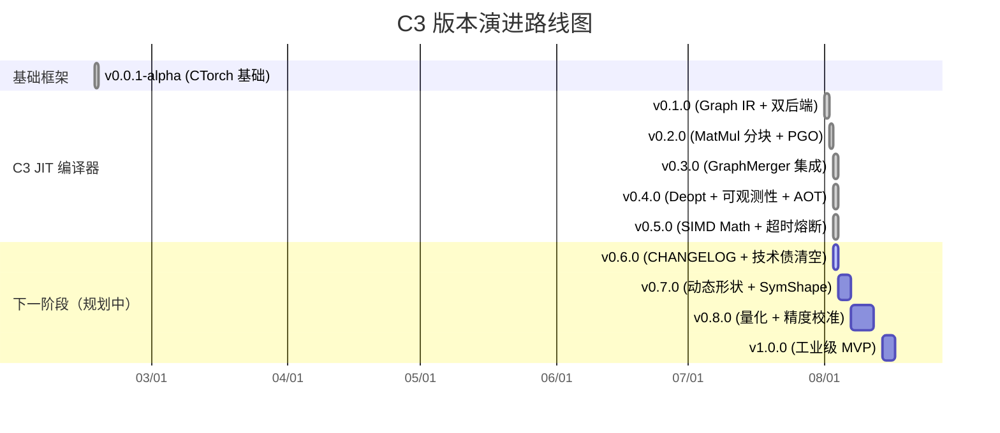

# CHANGELOG

> CTorch JIT 编译器（C3）版本日志
> 格式基于 [Keep a Changelog](https://keepachangelog.com/zh-CN/1.0.0/)，版本号遵循 [SemVer](https://semver.org/lang/zh-CN/)。

---

## [v0.5.0] — 2026-08-03

### 新增

- **SIMD 向量化超越函数库**（ADR-009）：AVX2 和 NEON 双平台支持，7 个核心函数（exp/log/tanh/sigmoid/GELU/Softmax/CrossEntropy），平均加速 5.85×（NEON aarch64, N=1M）
- **7 个 SIMD kernel 集成**：Exp_SIMD, Log_SIMD, Tanh_SIMD, Sigmoid_SIMD, GELU_SIMD, Softmax_SIMD, CrossEntropy_SIMD

### 修复

- **PGO 编译错误传播**（ADR-010）：`PGOCompiledKernel::recordCompileError` 现在同时回传到 `C3Engine::getLastCompileError()`，调用方无需保留 PGO kernel 指针即可查询所有编译错误
- **异步编译 watchdog 超时熔断**（ADR-011）：`compileAsync` 新增 watchdog 线程，默认 30s 超时后返回 nullptr 给调用方，后台编译继续完成并写入 cache
- **watchdog 实现中的两个死锁**（P1 修复）：
  - `compileAsync` 在持 `state.mutex` 时调 `promise->set_value` → 子线程互锁
  - `reapCompletedFutures` 在锁内 `erase` 触发 `~std::future` 等待 task 结束 → 经典互锁
  - 修复方案：reaper 改为两阶段（锁内 move-out + 锁外析构 sinked future）

### 新增 API

| API | 说明 |
|---|---|
| `C3Engine::setCompileTimeoutMs(uint32_t)` | 配置异步编译超时（默认 30000ms，0=永不） |
| `C3Engine::getCompileTimeoutMs()` | 读取当前超时配置 |
| `C3Engine::recordCompileError(prefix, err)` | 记录编译错误到全局状态（内部回调） |

### 文档

- [ADR-009-vectorized-transcendentals.md](docs/adr/ADR-009-vectorized-transcendentals.md)
- [ADR-010-pgo-error-propagation.md](docs/adr/ADR-010-pgo-error-propagation.md)
- [ADR-011-compile-timeout.md](docs/adr/ADR-011-compile-timeout.md)

### 测试

- `test_c3_compile_timeout`：14 个场景覆盖默认超时配置、正常路径、核心熔断、永不超时、超时后 cache 命中、错误状态管理
- `test_c3_compile_error`：ADR-010 传播验证（PGO → C3Engine 双向查询）
- `bench_simd_math`：NEON 端 5.85× 加速比验证

### 全量回归

| 测试套件 | 用例数 | 状态 |
|---|---|---|
| test_c3_aot_cache | 16 | ✅ |
| test_c3_compile_and_inject | 4 | ✅ |
| test_c3_compile_error | 11 | ✅ |
| test_c3_compile_merged | 10 | ✅ |
| test_c3_compile_merged_pgo | 11 | ✅ |
| test_c3_compile_timeout | 14 | ✅ |
| test_c3_pgo_deopt | 7 | ✅ |
| test_c3_graph | 108 | ✅ |
| test_graph_merger | 8 | ✅ |
| **全量 C3 回归** | **~190** | **✅** |

---

## [v0.4.0] — 2026-08-03

### 新增

- **PGO 运行时 deoptimization**（ADR-006）：`PGOCompiledKernel` 支持 O2 编译失败时优雅降级，保留 Eager 执行路径，出错时记录 `last_compile_error_` 并提供 `deopt_count_` 统计
- **getLastCompileError 编译错误可观测性**（ADR-007）：`C3Engine::getLastCompileError()` 查询最近一次编译失败原因，支持 `clearLastCompileError()` 清空状态；`PGOCompiledKernel::lastCompileError()` 查询 PGO 内部的 O2/Ofast 错误
- **AOT 持久化 .so cache**（ADR-008）：SHA-256 key 派生 + atomic 写入 + 版本校验 + 静默降级至 in-memory，冷启动 ~21× 加速（miss 1.5-2.3s → hit 70-100ms）

### 新增 API

| API | 说明 |
|---|---|
| `C3Engine::getLastCompileError()` | 返回最近一次编译错误（空字符串表示无错误） |
| `C3Engine::clearLastCompileError()` | 清空编译错误状态 |
| `PGOCompiledKernel::lastCompileError()` | 返回 PGO 内部最后一次编译错误 |
| `PGOCompiledKernel::clearLastCompileError()` | 清空 PGO 内部错误状态 |
| `PGOCompiledKernel::deoptCount()` | 返回 deoptimization 触发次数 |
| `PGOCompiledKernel::lastDeoptReason()` | 返回最近一次 deoptimization 原因 |
| `C3Engine::setAOTCacheEnabled(bool)` | 启用/禁用 AOT 持久化 |
| `C3Engine::getAOTCacheStats()` | 返回 AOT 缓存统计（hits/misses/writes/evictions/load_failures） |
| `C3Engine::evictAOTCache()` | 清空磁盘缓存 |

### 修复

- 无功能性修复（此版本专注新增能力）

### 文档

- [ADR-006-pgo-deoptimization.md](docs/adr/ADR-006-pgo-deoptimization.md)
- [ADR-007-pgo-compile-error-observability.md](docs/adr/ADR-007-pgo-compile-error-observability.md)
- [ADR-008-aot-persistent-cache.md](docs/adr/ADR-008-aot-persistent-cache.md)

### 测试

- `test_c3_pgo_deopt`：7 个场景覆盖 deoptimization 全路径
- `test_c3_compile_error`：6 个场景覆盖错误查询、PGO 错误传播、clearLastCompileError
- `test_c3_aot_cache`：16 个场景覆盖 cache hit/miss、版本校验、atomic 写入、fallback 路径

---

## [v0.3.0] — 2026-08-03

### 新增

- **GraphMerger 集成**（Phase B）：`C3Engine::compileMerged` 系列 API，支持 N 个子图按链接规格融合编译
- **PGO 融合编译**：`compileMergedPGO` 一条链自动完成 profile → O2 → Ofast 升级
- **异步编译去重**：`compileAsync` 同一 cache key 多个调用返回同一个 `shared_future`
- **GraphMerger 边界场景测试**：P1-1 修复（多输出子图、自环检测、空图、单节点图等）

### 修复

- **PGO FusedNode interpreted-execution DAG 引用 bug**：FusedNode 在 Eager 模式下的输入指针生命周期管理修复
- **Storage::Deleter UAF**（P0 修复）：退出期 `Storage::Deleter` 调 `AllocatorManager` 但 Meyers 单例已析构；改为 `shared_ptr<DeviceAllocator>` 引用计数管理

### 新增 API

| API | 说明 |
|---|---|
| `C3Engine::compileMerged()` | 多子图融合编译 |
| `C3Engine::compileMergedPGO()` | 多子图融合编译 + PGO 升级链 |
| `C3Engine::compileAsync()` | 异步编译（返回 `CompileFuture`） |
| `C3Engine::compileParallel()` | 并行编译多个独立子图 |
| `C3Engine::shutdown()` | 等待所有后台编译任务完成并释放资源 |
| `C3Engine::getCacheStats()` | 返回缓存统计信息 |
| `C3Engine::clearCache()` | 清空 in-memory 缓存 |

### 测试

- `test_c3_compile_merged`：10 个场景
- `test_c3_compile_merged_pgo`：11 个场景
- `test_c3_compile_and_inject`：4 个场景（热替换验证）

---

## [v0.2.0] — 2026-08-02

### 新增

- **MatMul 分块 + epilogue fusion**：`PatternMatcher` 贪心自顶向下匹配（FCWithActivation > FC > Activation > BiasAdd），`TileSelector` 选择最优分块策略
- **PGO 两阶段编译**：`PGOCompiledKernel` Eager 模式收集 profile → 热路径检测 → 自动升级到 MLIR 编译
- **PatternMatcher**：`matchAll()` 分 4 轮匹配，匹配结果包含拓扑顺序、模式类型、人类可读描述
- **MLP 端到端 benchmark**：`test_c3_mnist_step` / `test_c3_mnist_train` MNIST 训练/推理验证

### 变更

- `CompileOptions` 新增 `pgo_mode`、`enable_profiling`、`cache_key_override` 字段
- 编译队列背压机制：队列长度 > 32 时 O2 降级为 Eager 直通

### 文档

- [ADR-005-pgo-fused-node-positional-encoding.md](docs/adr/ADR-005-pgo-fused-node-positional-encoding.md)

### 测试

- `test_c3_matmul_blas`：BLAS 库集成验证
- `test_c3_mnist_step`：MLP 单步训练验证
- `test_c3_compile_time`：编译时间统计

---

## [v0.1.0] — 2026-08-01

### 新增

- **C3 编译引擎 Phase 0**：Graph IR（DAG 节点 + 拓扑排序 + 死代码消除），`C3Engine` 单例，`compile()` / `compileAsync()` 基础 API
- **MLIR 后端**（`CT_ENABLE_MLIR`）：`#ifdef` 编译开关，`MLIRKernelGen` 生成 MLIR → LLVM IR → ExecutionEngine JIT
- **Handwritten 后端**：`HandwrittenKernelGen` 生成 C++ kernel → clang++ 编译 .so → dlopen 加载
- **算子融合**：`FusedCompiledKernel` 支持 Add+ReLU 等连续算子融合为单个 kernel
- **热替换**（Atomic Pointer）：`C3KernelRegistry` 支持运行时 `install()` 热替换 kernel 指针
- **缓存**：in-memory LRU 缓存（256 条目上限），`makeCacheKey()` 基于图结构 + 编译选项派生

### 变更

- `CompileOptions` 新增 `backend`、`target_device`、`opt_level`、`enable_fusion`、`enable_cache`、`enable_autotune` 字段

### 测试

- `test_c3_graph`：108 个测试覆盖 Graph IR、编译流程、双后端一致性
- `test_c3_compile_and_inject`：热替换验证

---

## [v0.0.1-alpha] — 2026-02-16

### 新增

- **CTorch 基础框架**：Tensor 类、Storage 内存管理、AutoGrad 自动微分、调度器（CtorchScheduler）
- **算子实现**：Add, Sub, Mul, Div, MatMul, Exp, Log, Sin, Cos, Neg, Abs, ReLU, LReLU, Sigmoid, Tanh, GELU, Softmax, CrossEntropy, Max, Min, MSE, MAE
- **多后端支持**：CPU-BASIC、CPU-SIMD（x86 SSE/AVX2）、MPS（Metal Performance Shaders）
- **设备分配器**：`DeviceAllocator` / `AllocatorManager` 统一内存管理
- **单元测试**：核心语义、AutoGrad、MPS、kernel 热替换、unary in-place

### 修复

- **整数溢出**（CWE-190）：`Storage` 分配时 `checked_mul` 溢出检查
- **MPS buffer 同步**：`data_read()` 自动同步 MPS 路径，`data_write()` 标记 buffer 修改
- **MPS view/offset**：`MPS_markBufferModified` 和 `MPS_getBuffer` 处理 `_storage_offset`
- **MPS 异步同步**：buffer 读取前确认 command buffer 已完成
- **广播梯度约简**：右对齐维度计算，`BroadcastUtils.h` 共享工具
- **MPS in-place contiguous 检查**：`is_contiguous()` 强制检查
- **LReLU MPS kernel**：新增 MPS kernel 支持
- **Tensor::to() 跨设备 dtype 处理**：修复 dtype 转换时未正确处理跨设备路径

### 已知问题

- `test_c3_graph` 退出期 LLVM/MLIR 全局静态析构段错误（需 `clearCache()` + 显式 shutdown 缓解）
- stderr 偶发 `recursive_mutex lock failed: Invalid argument`（std::async 析构期，主流程未受影响）

---

## 版本演进路线

---

## 贡献者

- CTorch 团队
- 苏璃珞（CTorch Agent）

---

*本 CHANGELOG 由 `CHANGELOG.md` 自动维护，commit 历史可追溯至 2026-07-30。*