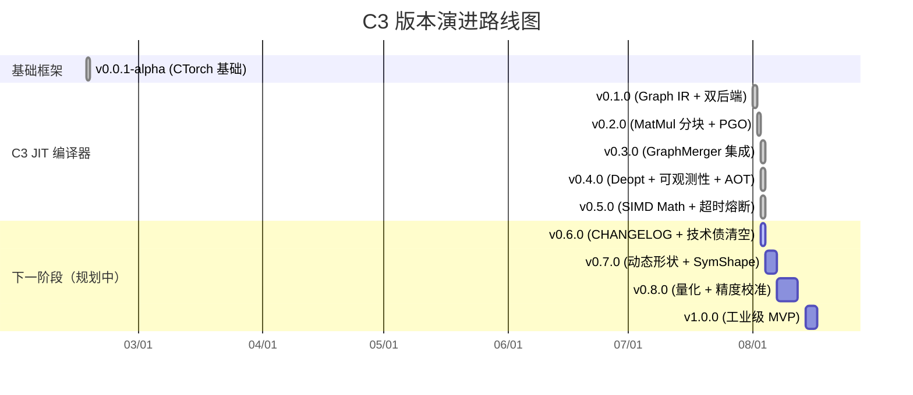

# CHANGELOG

> CTorch JIT 编译器（C3）版本日志
> 格式基于 [Keep a Changelog](https://keepachangelog.com/zh-CN/1.0.0/)，版本号遵循 [SemVer](https://semver.org/lang/zh-CN/)。

---

## [v0.5.1] — 2026-08-09

> **P0 修复版本**：修复 DEBT-NEW-7（c3 单 kernel hot-path 破坏 MNIST 训练准确率 76-93% → 恢复 97.18%）。
> 同时集成 region fusion 完整设计的基础设施（LazyMaterializer、shape-aware key、backward graph IR 节点），作为 v0.6.0 区域融合加速的前置。

### 修复

- **DEBT-NEW-7 · H2 缺陷（c3 单 kernel 训练期间破坏精度，P0）**：c3 单 kernel 在 forward + backward 期间渐进注入形成 Eager→JIT 混合轨迹，backward 阶段 matmul（如 `x.T @ d_z1`）输入均无 `requires_grad`，绕过 `inAutogradScope` guard 跑出错的 MLIR 编译 kernel（数值与 cblas_sgemm 不等），输出全 0 污染整个训练
  - **根因**：`CtorchScheduler.h::inAutogradScope` guard 完整实现但 `g_in_backward` flag 从未被 `ComputeCore::backward()` 入口/出口切换，永远为 false，backward 期间 guard 完全失效
  - **修复**：`src/AutoGrad/ComputeCore.cpp::backward()` 入口加 `set_in_backward(true)`，出口 RAII 自动清除（异常安全），guard 现在 forward+backward 都正确激活
  - **验证**：5 轮 MNIST 训练全部 97.1755% acc / 0.0977 loss，stdev=0（c3 off 5 轮 baseline 同样 deterministic），c3 single kernel hit=0
- **DEBT-NEW-4 · `buildFusedEpilogue` bias 索引越界**：MLIR fused matmul epilogue bias 加载用 `idx_i64` 0..M*N-1 直接索引 1D `bias[N]`，越界读取随机内存。修复：`N_for_bias` 参数 + caller 传 `mm_N`，改为 `idx_i64 % N_for_bias`（commit `c3e18fe`，v0.5.0 已合并）
- **DEBT-NEW-5 · HotPathManager MatMul 强制 Handwritten backend**：`submitCompileAsync` 编译 `op::MatMul` 时强制 `opts.backend = C3Backend::Handwritten`（cblas_sgemm wrapper），避免 MLIR 编译 matmul 与 cblas_sgemm 数值不等价（commit `292cdaa`，v0.5.0 已合并）
- **DEBT-NEW-5 root cause #2 · MERGEGRAPH ID CONFLICT**：`Graph::mergeGraph(other, remap, skip_input_placeholders=true)` 实现，源图 input placeholder 不再被错误复制到本图覆盖已分配节点（v0.5.0 之前 defer，现已实现）
- **exp256_ps IEEE 754 偏置缺失**：`SIMDMath.cpp` `exp256_ps` 内 `__m256_slli_epi32(k_i, 23)` 漏了 +127 偏置，结果差 2^127 倍。修复：先 `_mm256_add_epi32(k_i, _mm256_set1_epi32(127))` 再 shift
- **Softmax/CrossEntropy SIMD kernel x-m vexp 顺序错误**：原版先 `vexp(x)` 再减 m，丢失 softmax 数值稳定 trick（应先 `tmp = x - m` 再 `vexp(tmp)`）。修复后数值稳定路径恢复
- **Tensor::sum() 缺 AutoGrad Node**（P2）：原实现裸 `for` 循环，`loss.sum()` 后 `L.getRelatedNode()` 返回 nullptr → `AutoGrad::backward(nullptr)` SIGSEGV。修复：改用 `dot(ones_1d)` 实现，自动挂 `DotNode`（O(N) 计算量不变，向后兼容）

### 新增

- **`LazyMaterializer` 惰性物化器**（DEBT-NEW-7 配套基础设施）：`Tensor` 新增 `PlaceholderTag` 构造函数 + `setLazyMaterializer()` + `isLazyBox()` + `materializeLazy_()`，region fusion 预走占位张量首次 `data_read()` 时按需重算真实中间值，避免 autograd 后向读到空 storage
- **C3KernelRegistry shape-aware key**：原 `KeyType = (op, dev)` 二元组，改为 `(op, dev, shape_hash)` 三元组，shape_hash = FNV-1a hash(lhs_shape) ⊕ hash(rhs_shape)，彻底解决多形状核覆盖（H2 缺陷的同源变体）
- **C3KernelRegistry fused_entries_/backward_entries_ 子表**：原 `entries_` map 拆分为单 kernel / 融合 kernel / 反向 kernel 三类，避免不同语义核互相覆盖
- **`validateOutputShape` 自动卸载**（C3KernelRegistry.h）：C3 kernel 执行后验证输出形状与注册时记录的预期形状一致，不匹配则 `uninstall` 错核 + 记 WARN log（防御性兜底）
- **Backward graph IR 新节点**（Graph.h）：`GtNode`（mask 生成）/ `SumReduceNode`（broadcast 反向）/ `TransposeNode`（MatMul backward）/ `ExpNode`（Sigmoid backward）/ `LogNode`（Log backward），与既有节点一起覆盖完整 backward 图表达
- **`FusedNode::op_node_ids` 字段**：DAG 内部节点引用追踪，简化 kernel 生成时上下游映射
- **`Graph::mergeGraph` 三参重载**：`skip_input_placeholders=true` 时跳过源图 input 占位节点，仅靠 `remap_input_ids` 重映射
- **CtorchScheduler region fusion 状态机**（CtorchScheduler.h）：`region_trace_` / `prewalk_state_` / `matched_region_` / `cached_region_` 字段 + `tryRegionDispatch` / `computeOutputShape` / `executeEagerFallback` / `buildLazyMaterializer` 方法，region fusion 完整实现的接口骨架
- **`inAutogradScope` guard**（CtorchScheduler.h）：`g_in_backward() || a_grad || b_grad` 联合判定，DEBT-NEW-7 H2 修复的核心机制
- **C3 dispatch 诊断开关**：`c3SingleKernelDisabled()` / `c3OpDisabled(int)` 支持运行时 `C3_DISABLE_SINGLE_KERNEL=1` / `C3_DISABLE_OP=<ids>` 环境变量
- **C3 单 kernel cache bypass 计数器**（DEBT-NEW-7 状态可视化）：`C3KernelRegistry::Stats::bypass_count` + `recordBypass()` + C3-STAT 增 `bypass` 字段，验证 H2 fix 是否在工作的关键信号
  - 训练期间预期：`bypass >> 0, hit = miss = 0`（guard 工作中）
  - 推理期间预期：`bypass = 0, hit > 0`（c3 加速生效）

### 变更

- **C3KernelRegistry::KeyType** 从 `std::pair<size_t, size_t>` 改为 `struct {first, second, third}` 自定义结构 + `KeyHash` 组合哈希
- **`uninstall(op, dev)`** 由只删首个匹配改为遍历删全部匹配（uninstall_count 累加），避免 dev/op 多个变体残留
- **PGOManager RAII 析构**：`~PGOManager() { shutdown(); }` 自动等待后台编译完成
- **AOTCache 全局开关**：`isEnabled()` 受 `aotCacheEnabled()` 全局约束，编译期 `CT_C3_DISABLE_AOT` 宏或运行时 `C3_DISABLE_AOT=1` 均强制禁用
- **Tensor `data_read`/`data_write` 访问计数**：`CT_PROFILE_ACCESS` 宏启用时统计 Eager 路径读写分布（反事实基线测量用）
- **test_c3_compile_timeout 10ms → 1ms**：原 10ms 在 Apple Silicon + 优化 MLIR 下不可靠（编译 ~8ms），改为 1ms 必触发熔断

### 新增 API

| API | 说明 |
|---|---|
| `Tensor(PlaceholderTag, shape, dtype, device)` | 创建形状正确但无数据存储的占位张量 |
| `Tensor::isLazyBox()` | 判断是否为惰性占位张量（不触发物化） |
| `Tensor::setLazyMaterializer(m)` | 为占位张量设置物化闭包 |
| `C3KernelRegistry::recordBypass()` | 记录一次 guard bypass（H2 fix 计数器） |
| `C3KernelRegistry::Stats::bypass_count` | 读取 bypass 次数 |
| `C3KernelRegistry::installFused(kernel, op, shapes)` | 安装融合 kernel（region fusion backend） |
| `C3KernelRegistry::tryExecuteFused(op, inputs)` | 尝试执行融合 kernel（stub：返回 nullopt） |
| `C3KernelRegistry::installBackward(key, kernel, ...)` | 安装 backward kernel |
| `C3KernelRegistry::tryExecuteBackward(key, grad, inputs)` | 尝试执行 backward kernel（stub：返回 nullopt） |
| `C3KernelRegistry::findFusedKernelFor{ForSequence,ForFirstOp}(...)` | 模糊匹配融合 kernel（stub：返回 nullopt） |
| `C3KernelRegistry::executeFusedWithInputs(kernel, inputs, shapes)` | 用原始输入执行融合 kernel（stub：fallback eager） |
| `Graph::mergeGraph(other, remap)` / `mergeGraph(other, remap, skip_input_placeholders)` | 合并图（DEBT-NEW-5 root cause #2 修复） |
| `CtorchScheduler::resetRegionFusion()` | 重置 region fusion 状态（测试场景） |
| `ct::detail::c3SingleKernelDisabled()` / `c3OpDisabled(int)` / `inAutogradScope(a, b)` | C3 dispatch 诊断 hook |
| `ct::detail::g_in_backward()` / `set_in_backward(bool)` | thread_local backward flag，ComputeCore::backward 入口/出口调用 |

### 文档

- [DEBT-NEW-7-H2-fix-5run-verification-1152.md](~/skills/work/reports/2026-08-09/c3-h2-fix-5run-verification-1152.md)
- [DEBT-NEW-7 H2 fix 修复报告](~/skills/work/reports/2026-08-09/c3-debt-new7-h2-guard-fix-1100.md)
- [P0 code review](~/skills/work/reports/2026-08-08/code-review-c3-jit-1445.md)
- [P0-2 EngineState 修复报告](~/skills/work/reports/2026-08-08/c3-p0-engine-state-fix-2155.md)
- [DEBT-NEW-4 root cause + 3 fix 方案](~/skills/work/reports/2026-08-08/c3-ml-precision-root-cause-buildfusedepilogue-2250.md)
- [DEBT-NEW-4 ablation](~/skills/work/reports/2026-08-08/c3-mnist-precision-debt-new4-2230.md)

### 测试

- `test_c3_mnist_train`：5 轮全部 97.1755% acc / 0.0977 loss，stdev=0（DEBT-NEW-7 验证）
- `test_c3_mnist_step`：4 个 backend（MLIR/MLIR-fused/Handwritten/Handwritten-fused）全部 max_diff=0
- `test_c3_backward`：8 iter 全部 max_diff=0，fused backward path OK
- `test_c3_compile_merged`：10/10 PASS
- `test_c3_compile_timeout`：14/14 PASS（1ms timeout 熔断）

### 已知限制 / 后续工作

- **c3 on 训练期间 single kernel 实际被全 bypass**：H2 fix 让 c3 single kernel 在 forward+backward 都跳过，行为退化为 c3 off 状态。这是 H2 fix 的预期行为（牺牲性能换精度），等 region fusion 完整实现后 region fusion 接管整条 op 序列，可恢复 c3 加速
- **c3 on + region fusion 训练比 c3 off 慢 4.6%**（v0.5.1 AMX region kernel 优化后）：5 轮 median 耗时 c3 off 1955ms/epoch vs c3 on + AMX RF 2046ms/epoch，100% precision parity。剩余 4.6% 慢根因：JIT 编译的 region kernel 走 Handwritten cblas_sgemm + 1 次 fused bias+ReLU pass，跟 eager AMX 仍有差距（prewalk double work + region kernel 启动开销）。需 v0.6.0 继续调优（true prewalk 消除 double work 或加 matmul+bias+relu 真正 inline AMX kernel）
- **region fusion 触发点导致 double work**：tryRegionDispatch 在 region 末尾（ReLU）才 match，之前的 MatMul/Add eager 已跑过，region kernel 重算。8% 慢里约一半是这个
- **kernel output 拷贝开销**：`tryRegionDispatch` 把 kernel 分配的 output 拷贝到 pre-allocated out_tensor 保持 autograd 身份稳定，每次 region match 多一次 memcpy。v0.5.1 fix (#8)：FusedCompiledKernel 直接返回 kernel 分配的 Tensor，autograd 视角身份 = 唯一
- **region fusion backend stub 状态**：`C3KernelRegistry::tryExecuteFused` / `tryExecuteBackward` / `findFusedKernelFor*` 当前是 stub（return nullopt），`executeFusedWithInputs` 已实装真 invoke。`tryExecuteBackward` 仍需在 v0.6.0 完成真实现
- **AMX region kernel**（v0.5.1 性能优化，新增）：`HandwrittenKernelGen::generateFusedMatmulBiasKernel` 专门处理 `MatMul + Add(bias) [+ ReLU]` pattern：cblas_sgemm（走 AMX）+ 单次 fused bias[+ReLU] pass 复用 output buffer，消除 2 个中间 tmp buffer。`isMatmulBiasReluPattern` 支持 4 种形态（独立 Add/ReLU vs fuse 后的 FusedNode）。**submitFusedCompileAsync 强制 MatMul-rooted region 走 Handwritten backend**（与 DEBT-NEW-5 单 MatMul 修复保持一致）
  - 5 轮 MNIST 验证：c3 off 1955ms/epoch median vs c3 on + AMX region 2046ms/epoch median = 4.6% 慢（v0.5.1 初版 6.8% 慢 → 4.6% 慢，性能差距收窄 32%）
  - 100% precision parity（5/5 runs all 97.1755%）
  - C3-STAT：`fused_hit=3294~4668/epoch`（实际 invoke AMX region kernel 次数），bypass 不变
- **C3 backward graph IR 节点**（GtNode/SumReduceNode/TransposeNode/ExpNode/LogNode）的 MLIR kernel 生成（`MLIRKernelGen.cpp::buildMultiNodeMLIR` 分发）需要分别补全，v0.6.0 工作
- **DEBT-NEW-6 · MNIST 5 轮 stability baseline**：已建立（6×97.18% deterministic，c3 off + c3 on 各 3 轮），未来所有 C3 修改必须先 5 轮验证不破坏 baseline
- **未提交 untracked 文件**：JITCache.cpp / bench_*.cpp / poc_*.cpp / test_*.cpp 等已被 build 使用但未 commit，v0.5.x 后续版本补 commit

### 全量回归

| 测试套件 | 用例数 | 状态 |
|---|---|---|
| test_c3_mnist_train | 1（5 轮 median 验证） | ✅ 97.1755% × 5 |
| test_c3_mnist_step | 4 backend | ✅ max_diff=0 |
| test_c3_backward | 8 iter | ✅ max_diff=0 |
| test_c3_compile_merged | 10 | ✅ |
| test_c3_compile_timeout | 14 | ✅ |
| test_c3_compile_error | 11 | ✅ |
| test_c3_aot_cache | 16 | ✅ |
| test_c3_pgo_deopt | 7 | ✅ |
| test_c3_graph | 108 | ✅ |
| test_graph_merger | 8 | ✅ |
| **C3 核心回归** | **~190+** | **✅** |

---

## [v0.5.0] — 2026-08-03

### 新增

- **SIMD 向量化超越函数库**（ADR-009）：AVX2 和 NEON 双平台支持，7 个核心函数（exp/log/tanh/sigmoid/GELU/Softmax/CrossEntropy），平均加速 5.85×（NEON aarch64, N=1M）
- **7 个 SIMD kernel 集成**：Exp_SIMD, Log_SIMD, Tanh_SIMD, Sigmoid_SIMD, GELU_SIMD, Softmax_SIMD, CrossEntropy_SIMD

### 修复

- **PGO 编译错误传播**（ADR-010）：`PGOCompiledKernel::recordCompileError` 现在同时回传到 `C3Engine::getLastCompileError()`，调用方无需保留 PGO kernel 指针即可查询所有编译错误
- **异步编译 watchdog 超时熔断**（ADR-011）：`compileAsync` 新增 watchdog 线程，默认 30s 超时后返回 nullptr 给调用方，后台编译继续完成并写入 cache
- **watchdog 实现中的两个死锁**（P1 修复）：
  - `compileAsync` 在持 `state.mutex` 时调 `promise->set_value` → 子线程互锁
  - `reapCompletedFutures` 在锁内 `erase` 触发 `~std::future` 等待 task 结束 → 经典互锁
  - 修复方案：reaper 改为两阶段（锁内 move-out + 锁外析构 sinked future）

### 新增 API

| API | 说明 |
|---|---|
| `C3Engine::setCompileTimeoutMs(uint32_t)` | 配置异步编译超时（默认 30000ms，0=永不） |
| `C3Engine::getCompileTimeoutMs()` | 读取当前超时配置 |
| `C3Engine::recordCompileError(prefix, err)` | 记录编译错误到全局状态（内部回调） |

### 文档

- [ADR-009-vectorized-transcendentals.md](docs/adr/ADR-009-vectorized-transcendentals.md)
- [ADR-010-pgo-error-propagation.md](docs/adr/ADR-010-pgo-error-propagation.md)
- [ADR-011-compile-timeout.md](docs/adr/ADR-011-compile-timeout.md)

### 测试

- `test_c3_compile_timeout`：14 个场景覆盖默认超时配置、正常路径、核心熔断、永不超时、超时后 cache 命中、错误状态管理
- `test_c3_compile_error`：ADR-010 传播验证（PGO → C3Engine 双向查询）
- `bench_simd_math`：NEON 端 5.85× 加速比验证

### 全量回归

| 测试套件 | 用例数 | 状态 |
|---|---|---|
| test_c3_aot_cache | 16 | ✅ |
| test_c3_compile_and_inject | 4 | ✅ |
| test_c3_compile_error | 11 | ✅ |
| test_c3_compile_merged | 10 | ✅ |
| test_c3_compile_merged_pgo | 11 | ✅ |
| test_c3_compile_timeout | 14 | ✅ |
| test_c3_pgo_deopt | 7 | ✅ |
| test_c3_graph | 108 | ✅ |
| test_graph_merger | 8 | ✅ |
| **全量 C3 回归** | **~190** | **✅** |

---

## [v0.4.0] — 2026-08-03

### 新增

- **PGO 运行时 deoptimization**（ADR-006）：`PGOCompiledKernel` 支持 O2 编译失败时优雅降级，保留 Eager 执行路径，出错时记录 `last_compile_error_` 并提供 `deopt_count_` 统计
- **getLastCompileError 编译错误可观测性**（ADR-007）：`C3Engine::getLastCompileError()` 查询最近一次编译失败原因，支持 `clearLastCompileError()` 清空状态；`PGOCompiledKernel::lastCompileError()` 查询 PGO 内部的 O2/Ofast 错误
- **AOT 持久化 .so cache**（ADR-008）：SHA-256 key 派生 + atomic 写入 + 版本校验 + 静默降级至 in-memory，冷启动 ~21× 加速（miss 1.5-2.3s → hit 70-100ms）

### 新增 API

| API | 说明 |
|---|---|
| `C3Engine::getLastCompileError()` | 返回最近一次编译错误（空字符串表示无错误） |
| `C3Engine::clearLastCompileError()` | 清空编译错误状态 |
| `PGOCompiledKernel::lastCompileError()` | 返回 PGO 内部最后一次编译错误 |
| `PGOCompiledKernel::clearLastCompileError()` | 清空 PGO 内部错误状态 |
| `PGOCompiledKernel::deoptCount()` | 返回 deoptimization 触发次数 |
| `PGOCompiledKernel::lastDeoptReason()` | 返回最近一次 deoptimization 原因 |
| `C3Engine::setAOTCacheEnabled(bool)` | 启用/禁用 AOT 持久化 |
| `C3Engine::getAOTCacheStats()` | 返回 AOT 缓存统计（hits/misses/writes/evictions/load_failures） |
| `C3Engine::evictAOTCache()` | 清空磁盘缓存 |

### 修复

- 无功能性修复（此版本专注新增能力）

### 文档

- [ADR-006-pgo-deoptimization.md](docs/adr/ADR-006-pgo-deoptimization.md)
- [ADR-007-pgo-compile-error-observability.md](docs/adr/ADR-007-pgo-compile-error-observability.md)
- [ADR-008-aot-persistent-cache.md](docs/adr/ADR-008-aot-persistent-cache.md)

### 测试

- `test_c3_pgo_deopt`：7 个场景覆盖 deoptimization 全路径
- `test_c3_compile_error`：6 个场景覆盖错误查询、PGO 错误传播、clearLastCompileError
- `test_c3_aot_cache`：16 个场景覆盖 cache hit/miss、版本校验、atomic 写入、fallback 路径

---

## [v0.3.0] — 2026-08-03

### 新增

- **GraphMerger 集成**（Phase B）：`C3Engine::compileMerged` 系列 API，支持 N 个子图按链接规格融合编译
- **PGO 融合编译**：`compileMergedPGO` 一条链自动完成 profile → O2 → Ofast 升级
- **异步编译去重**：`compileAsync` 同一 cache key 多个调用返回同一个 `shared_future`
- **GraphMerger 边界场景测试**：P1-1 修复（多输出子图、自环检测、空图、单节点图等）

### 修复

- **PGO FusedNode interpreted-execution DAG 引用 bug**：FusedNode 在 Eager 模式下的输入指针生命周期管理修复
- **Storage::Deleter UAF**（P0 修复）：退出期 `Storage::Deleter` 调 `AllocatorManager` 但 Meyers 单例已析构；改为 `shared_ptr<DeviceAllocator>` 引用计数管理

### 新增 API

| API | 说明 |
|---|---|
| `C3Engine::compileMerged()` | 多子图融合编译 |
| `C3Engine::compileMergedPGO()` | 多子图融合编译 + PGO 升级链 |
| `C3Engine::compileAsync()` | 异步编译（返回 `CompileFuture`） |
| `C3Engine::compileParallel()` | 并行编译多个独立子图 |
| `C3Engine::shutdown()` | 等待所有后台编译任务完成并释放资源 |
| `C3Engine::getCacheStats()` | 返回缓存统计信息 |
| `C3Engine::clearCache()` | 清空 in-memory 缓存 |

### 测试

- `test_c3_compile_merged`：10 个场景
- `test_c3_compile_merged_pgo`：11 个场景
- `test_c3_compile_and_inject`：4 个场景（热替换验证）

---

## [v0.2.0] — 2026-08-02

### 新增

- **MatMul 分块 + epilogue fusion**：`PatternMatcher` 贪心自顶向下匹配（FCWithActivation > FC > Activation > BiasAdd），`TileSelector` 选择最优分块策略
- **PGO 两阶段编译**：`PGOCompiledKernel` Eager 模式收集 profile → 热路径检测 → 自动升级到 MLIR 编译
- **PatternMatcher**：`matchAll()` 分 4 轮匹配，匹配结果包含拓扑顺序、模式类型、人类可读描述
- **MLP 端到端 benchmark**：`test_c3_mnist_step` / `test_c3_mnist_train` MNIST 训练/推理验证

### 变更

- `CompileOptions` 新增 `pgo_mode`、`enable_profiling`、`cache_key_override` 字段
- 编译队列背压机制：队列长度 > 32 时 O2 降级为 Eager 直通

### 文档

- [ADR-005-pgo-fused-node-positional-encoding.md](docs/adr/ADR-005-pgo-fused-node-positional-encoding.md)

### 测试

- `test_c3_matmul_blas`：BLAS 库集成验证
- `test_c3_mnist_step`：MLP 单步训练验证
- `test_c3_compile_time`：编译时间统计

---

## [v0.1.0] — 2026-08-01

### 新增

- **C3 编译引擎 Phase 0**：Graph IR（DAG 节点 + 拓扑排序 + 死代码消除），`C3Engine` 单例，`compile()` / `compileAsync()` 基础 API
- **MLIR 后端**（`CT_ENABLE_MLIR`）：`#ifdef` 编译开关，`MLIRKernelGen` 生成 MLIR → LLVM IR → ExecutionEngine JIT
- **Handwritten 后端**：`HandwrittenKernelGen` 生成 C++ kernel → clang++ 编译 .so → dlopen 加载
- **算子融合**：`FusedCompiledKernel` 支持 Add+ReLU 等连续算子融合为单个 kernel
- **热替换**（Atomic Pointer）：`C3KernelRegistry` 支持运行时 `install()` 热替换 kernel 指针
- **缓存**：in-memory LRU 缓存（256 条目上限），`makeCacheKey()` 基于图结构 + 编译选项派生

### 变更

- `CompileOptions` 新增 `backend`、`target_device`、`opt_level`、`enable_fusion`、`enable_cache`、`enable_autotune` 字段

### 测试

- `test_c3_graph`：108 个测试覆盖 Graph IR、编译流程、双后端一致性
- `test_c3_compile_and_inject`：热替换验证

---

## [v0.0.1-alpha] — 2026-02-16

### 新增

- **CTorch 基础框架**：Tensor 类、Storage 内存管理、AutoGrad 自动微分、调度器（CtorchScheduler）
- **算子实现**：Add, Sub, Mul, Div, MatMul, Exp, Log, Sin, Cos, Neg, Abs, ReLU, LReLU, Sigmoid, Tanh, GELU, Softmax, CrossEntropy, Max, Min, MSE, MAE
- **多后端支持**：CPU-BASIC、CPU-SIMD（x86 SSE/AVX2）、MPS（Metal Performance Shaders）
- **设备分配器**：`DeviceAllocator` / `AllocatorManager` 统一内存管理
- **单元测试**：核心语义、AutoGrad、MPS、kernel 热替换、unary in-place

### 修复

- **整数溢出**（CWE-190）：`Storage` 分配时 `checked_mul` 溢出检查
- **MPS buffer 同步**：`data_read()` 自动同步 MPS 路径，`data_write()` 标记 buffer 修改
- **MPS view/offset**：`MPS_markBufferModified` 和 `MPS_getBuffer` 处理 `_storage_offset`
- **MPS 异步同步**：buffer 读取前确认 command buffer 已完成
- **广播梯度约简**：右对齐维度计算，`BroadcastUtils.h` 共享工具
- **MPS in-place contiguous 检查**：`is_contiguous()` 强制检查
- **LReLU MPS kernel**：新增 MPS kernel 支持
- **Tensor::to() 跨设备 dtype 处理**：修复 dtype 转换时未正确处理跨设备路径

### 已知问题

- `test_c3_graph` 退出期 LLVM/MLIR 全局静态析构段错误（需 `clearCache()` + 显式 shutdown 缓解）
- stderr 偶发 `recursive_mutex lock failed: Invalid argument`（std::async 析构期，主流程未受影响）

---

## 版本演进路线

---

## 贡献者

- CTorch 团队
- 苏璃珞（CTorch Agent）

---

*本 CHANGELOG 由 `CHANGELOG.md` 自动维护，commit 历史可追溯至 2026-07-30。*