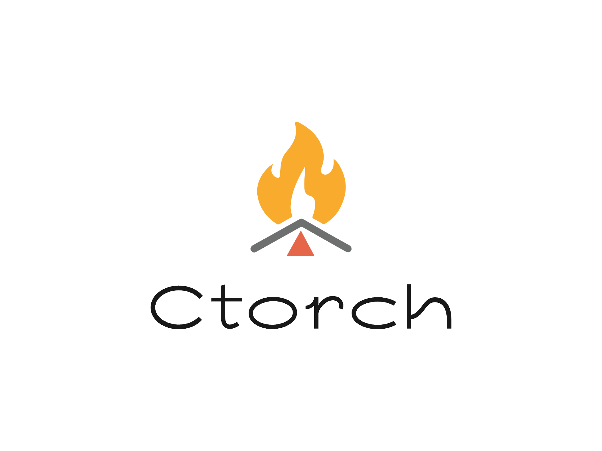

# Ctorch - 一个轻量级 C++ 深度学习框架

<picture>
  <source srcset="images/logo-dark.png" media="(prefers-color-scheme: dark)">
  
</picture>

## 项目简介

Ctorch 是一个由一名初中生和一名高中生共同开发的轻量级深度学习框架，用现代 C++ (C++20)实现。我们的目标是创建一个类似 PyTorch 的接口，让 C++ 开发者也能享受简单直观的深度学习体验。虽然还在早期开发阶段，但已经包含了所有核心操作！

```cpp
// 简单示例：创建张量和自动微分
#include <ctorch/tensor.h>

int main() {
    // 创建张量
    auto a = tensor({1.0, 2.0, 3.0});
    auto b = tensor({4.0, 5.0, 6.0});
    
    // 自动微分计算
    auto c = (a * b).sum();
    c.backward();
    
    std::cout << "a的梯度: " << a.grad() << std::endl;
    return 0;
}
```

## 为什么创建 Ctorch？

作为学生开发者，我们注意到：
- C++ 缺乏简单易用的深度学习库
- 现有库对学习者来说过于复杂
- 想通过实践深入理解深度学习原理
- 希望为 C++ 社区贡献开源项目

## 已实现功能

### 核心特性
✅ 多维张量（Tensor）支持  
✅ 自动微分（Autograd）系统  

### 张量运算
```cpp
// 基本运算
auto t = tensor({{1,2}, {3,4}});
t = t + 5;          // 广播加法
t = t.mm(t);        // 矩阵乘法
t = t.relu();       // 激活函数

// 索引操作
auto slice = t[0];  // 第一行
```

### 神经网络模块
```cpp
// 简单神经网络定义
struct Net : public Module {
    Linear fc1{20, 50}, fc2{50, 10};
    
    Tensor forward(Tensor x) {
        x = fc1(x).relu();
        x = fc2(x).log_softmax();
        return x;
    }
};

// 使用网络
Net model;
auto output = model.forward(input);
```

## 安装与使用

### 依赖项
- C++20 或更高版本
- CMake 3.12+

### 构建步骤
```bash
git clone https://github.com/Beapoe/CTorch.git
cd CTorch
mkdir build
cd build
cmake ..
make
```

### 运行测试
```bash
./build/test/ctorch_test
```

## 项目结构
```
ctorch/
├── include/          # 头文件
│   ├── tensor.h      # 张量实现
│   ├── autograd.h    # 自动微分
│   └── nn/           # 神经网络模块
├── src/              # 源代码
├── test/             # 单元测试
├── examples/         # 示例代码
│   ├── mnist/        # MNIST 示例
│   └── linear_reg/   # 线性回归
└── CMakeLists.txt    # 构建配置
```

我们欢迎任何形式的贡献！如果你是：
- 学生想学习深度学习系统
- 开发者有C++经验
- 教育工作者想使用教学

请查看 [CONTRIBUTING.md](CONTRIBUTING.md) 了解如何参与。

## 未来计划
- [ ] 卷积神经网络支持
- [ ] 循环神经网络模块
- [ ] ONNX 模型导入/导出
- [ ] 分布式训练支持
- [ ] 移动端部署优化

## 许可证

本项目采用 **MIT 许可证** - 详情见 [LICENSE](LICENSE) 文件。

---
> "虽然我们还在上学，但对深度学习的热情驱使我们创建这个项目。  
> 每一行代码都是学习的过程，欢迎和我们一起成长！"

联系邮箱：cyf31415@yeah.net
        beapoe1024@163.com

项目地址：https://github.com/Beapoe/CTorch

[](https://github.com/Beapoe/ctorch)
