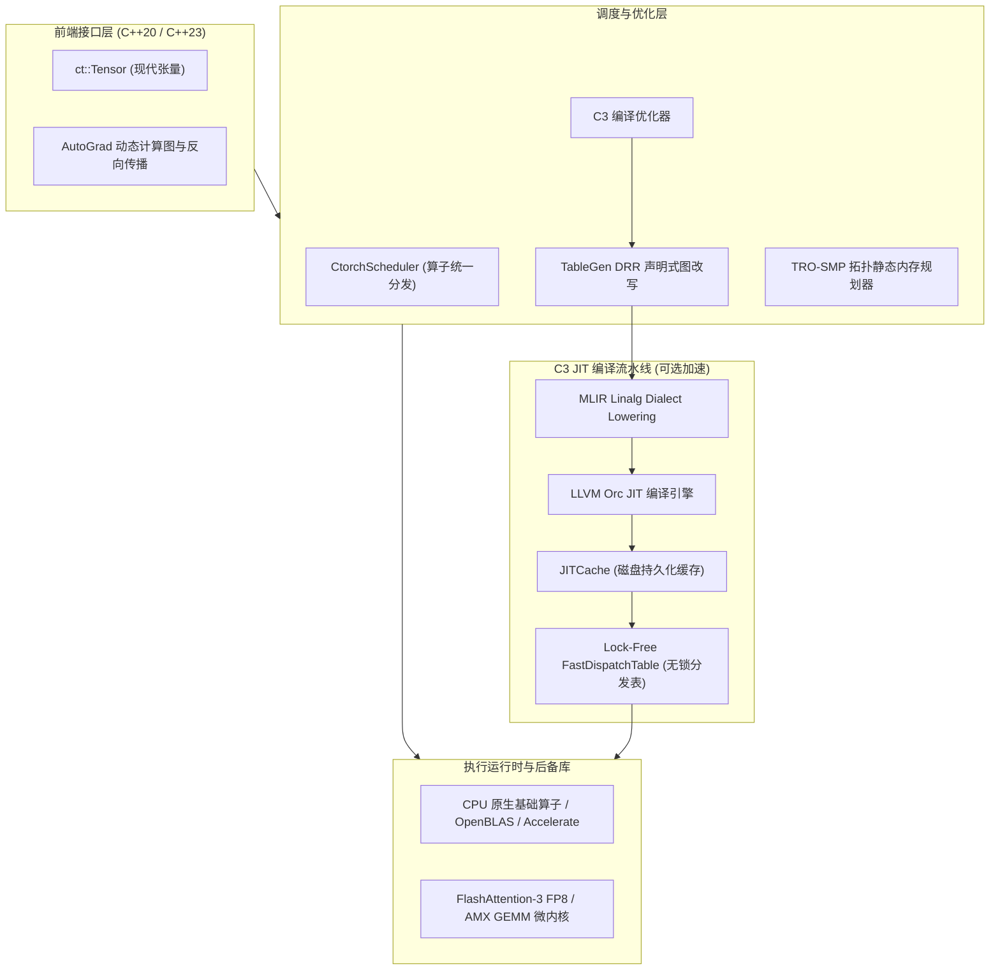

<div align="center">

<picture>
  <source srcset="images/logo-dark.png" media="(prefers-color-scheme: dark)">
  
</picture>

<h1>CTorch</h1>

<p>轻量级、现代 C++ 原生的深度学习与张量计算框架</p>

<p>
  <a href="#项目愿景">项目愿景</a> •
  <a href="#核心特性">核心特性</a> •
  <a href="#系统架构">系统架构</a> •
  <a href="#快速上手">快速上手</a> •
  <a href="#构建与测试">构建与测试</a> •
  <a href="#联系与交流">联系与交流</a>
</p>

<p>
  <a href="https://github.com/ShengFlow/CTorch/actions/workflows/ci.yml"></a>
  
  
  <a href="LICENSE"></a>
</p>

</div>

---

> [!NOTE]
> **CTorch** 是由 **笙歌@ShengFlow 团队** 开发并维护的开源深度学习框架。旨在为现代 C++ 开发者提供一套兼具优雅接口与底层性能的自主张量计算引擎。

## 项目愿景

在传统 C++ 深度学习落地中，开发者往往面临两难选择：
* 依赖重量级的工业级运行时（如 LibTorch），不仅体积庞大（数 GB），而且与宿主 C++ 项目混合构建繁琐；
* 从零手写计算库，又缺乏动态计算图、反向模式自动微分（AutoGrad）以及现代编译优化支持。

> **CTorch 的初衷是**：让 C++ 开发者能像写现代脚本语言一样直观地构建张量计算图，同时在底层拥有纯原生、零抽象开销的执行效率与 JIT 编译加速能力。

---

## 核心特性

| 模块 | 特性描述 | 状态 |
| :--- | :--- | :---: |
| **张量引擎** | 支持任意维度的 `Tensor`，具备切片、视图重塑（View）、数据共享与自动广播 | 支持 |
| **动态自动微分** | 反向模式 `AutoGrad`，细粒度节点追踪与动态构图，支持复杂的复合导数推导 | 支持 |
| **C3 编译系统** | 基于 **MLIR / LLVM Orc JIT**，实现 Linalg 算子单遍缓冲化与自动跨算子融合 | 支持 |
| **JITCache 缓存** | 字节码磁盘持久化与基于 Seqlock 的无锁快速分发表（FastDispatchTable） | 支持 |
| **TRO-SMP 内存规划** | 通过 DAG 拓扑重排复用静态内存空间，有效抑制运行期峰值内存消耗 | 支持 |
| **高性能微内核** | 引入 FlashAttention-3 FP8、AMX / NEON 融合矩阵乘法等现代计算算子支持 | 支持 |
| **轻量无依赖** | 全链路 C++20 原生开发，无 Python 运行时包袱，易于无缝嵌入各类 C++ 宿主工程 | 支持 |

---

## 系统架构


```mermaid
flowchart TD
    subgraph Frontend ["前端接口层 (C++20 / C++23)"]
        Tensor["ct::Tensor (现代张量)"]
        AutoGradAPI["AutoGrad 动态计算图与反向传播"]
    end

    subgraph Scheduler ["调度与优化层"]
        CtorchSched["CtorchScheduler (算子统一分发)"]
        C3Engine["C3 编译优化器"]
        DRR["TableGen DRR 声明式图改写"]
        MemoryPlanner["TRO-SMP 拓扑静态内存规划器"]
    end

    subgraph JITPipeline ["C3 JIT 编译流水线 (可选加速)"]
        MLIRLowering["MLIR Linalg Dialect Lowering"]
        LLVMOrc["LLVM Orc JIT 编译引擎"]
        JITCache["JITCache (磁盘持久化缓存)"]
        FastDispatch["Lock-Free FastDispatchTable (无锁分发表)"]
    end

    subgraph Backend ["执行运行时与后备库"]
        CPUBack["CPU 原生基础算子 / OpenBLAS / Accelerate"]
        MicroKernels["FlashAttention-3 FP8 / AMX GEMM 微内核"]
    end

    Frontend --> Scheduler
    C3Engine --> DRR
    DRR --> MLIRLowering
    MLIRLowering --> LLVMOrc
    LLVMOrc --> JITCache
    JITCache --> FastDispatch
    Scheduler --> Backend
    FastDispatch --> Backend
```

---

## 快速上手

### 基础张量计算与自动微分

以下代码演示了如何使用 CTorch 原生 C++20 API 进行张量创建、前向运算与梯度反向传播：

```cpp
#include "Tensor.h"
#include "AutoGrad.h"
#include <iostream>

int main() {
    // 1. 创建张量
    Tensor a({1.0f, 2.0f, 3.0f});
    Tensor b({4.0f, 5.0f, 6.0f});

    // 2. 开启自动微分追踪
    a.requires_grad(true);
    b.requires_grad(true);

    // 3. 构建计算图并前向运算
    Tensor c = a * b;
    Tensor loss = c.sum();

    // 4. 反向传播计算梯度
    AutoGrad::backward(loss.getRelatedNode(), /*retain_graph=*/false);

    // 5. 查看张量数值与梯度
    std::cout << "a: " << a << std::endl;
    std::cout << "loss: " << loss << std::endl;
    std::cout << "a.grad: " << a.grad() << std::endl;
    std::cout << "b.grad: " << b.grad() << std::endl;

    return 0;
}
```

> [!TIP]
> 算子执行时，如果启用了 C3 编译后端，高频运行的热点模式（Hot Path）会被后台编译优化器自动识别并进行 JIT 融合加速，无需手动改动任何前端代码。

---

## 构建与测试

### 环境依赖
* **编译器**: 支持 C++20 及以上的现代编译器（GCC 13+、Clang 17+ 或 Apple Clang）
* **构建系统**: CMake 3.20+ 与 Ninja
* **编译器后端 (可选)**: LLVM / MLIR 18+ (如需开启 C3 JIT 编译功能)
* **数学库**: OpenBLAS 或 macOS Accelerate Framework

### 编译步骤

```bash
# 1. 克隆仓库及子模块
git clone --recursive https://github.com/ShengFlow/CTorch.git
cd CTorch

# 2. 生成构建配置 (开启 MLIR 支持)
cmake -B build-release -G Ninja \
  -DCMAKE_BUILD_TYPE=Release \
  -DCT_ENABLE_MLIR=ON

# 3. 编译构建
ninja -C build-release

# 4. 执行回归测试套件
ctest --test-dir build-release --output-on-failure
```

> [!TIP]
> 若宿主环境未安装 LLVM/MLIR，可通过传入 `-DCT_ENABLE_MLIR=OFF` 进行纯轻量级构建，CTorch 将使用原生 C++ CPU 计算核执行。

---

## 联系与交流

欢迎任何形式的代码贡献、Issue 建议与交流反馈！

- **代码仓库**: [ShengFlow/CTorch](https://github.com/ShengFlow/CTorch)
- **联系邮箱**: `ctorch1024@163.com`
- **QQ**: 1113109729, 2713906889

---

<div align="center">

> *"遇事不决，可问春风，春风不语，即随本心."*  
> *—— 烽火戏诸侯《剑来》*

</div>
