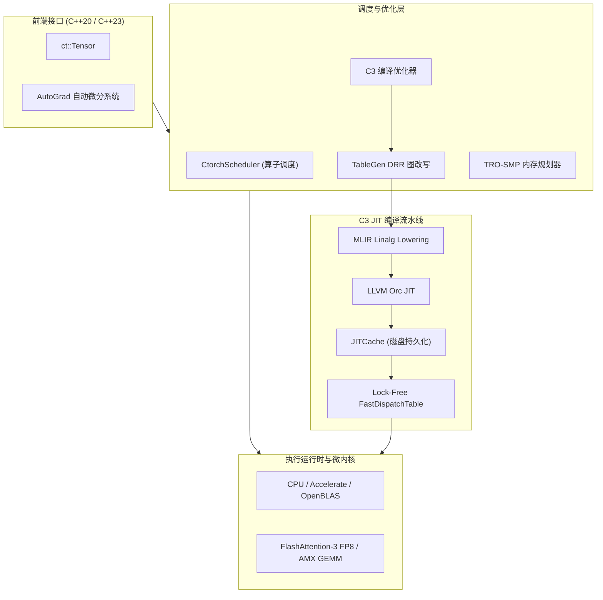

<div align="center">

<picture>
  <source srcset="images/logo-dark.png" media="(prefers-color-scheme: dark)">
  
</picture>

# CTorch

**一个现代 C++ 原生深度学习与张量计算框架**  
*A Modern C++ Deep Learning and Tensor Computation Framework*

[](https://github.com/ShengFlow/CTorch/actions/workflows/ci.yml)
[](https://en.wikipedia.org/wiki/C%2B%2B20)
[](https://mlir.llvm.org/)
[](LICENSE)

[项目简介](#项目简介) • [核心特性](#核心特性) • [系统架构](#系统架构) • [快速开始](#快速开始) • [构建与测试](#构建与测试) • [贡献与交流](#贡献与交流)

</div>

---

## 项目简介

**Ctorch** 是一个轻量级 C++ 深度学习框架，使用现代 C++（C++20/C++23）实现。项目由 **笙歌@ShengFlow 团队** 开发，目标是提供一个简洁直观、接口风格贴近直觉的 C++ 张量计算与自动微分环境。

目前项目已具备完整的张量体系与动态计算图自动微分功能，并引入了 **C3（MLIR/LLVM JIT）** 编译后端、拓扑静态内存规划（TRO-SMP）以及现代硬件微内核支持，兼顾易用性与计算效率。

---

## 核心特性

- ✅ **多维张量（Tensor）**：支持多维张量创建、切片、视图变换及广播机制
- ✅ **自动微分（AutoGrad）**：基于动态图的反向模式自动微分，支持复杂计算图反向求导
- ✅ **C3 编译优化（MLIR / LLVM）**：支持 Linalg 算子单遍缓冲化与垂直/水平融合 JIT
- ✅ **JITCache 缓存机制**：持久化字节码缓存与 Seqlock 无锁分发表，大幅减少热点路径重复编译开销
- ✅ **TRO-SMP 内存规划**：通过 DAG 拓扑重排复用静态内存空间，有效降低运行期内存峰值
- ✅ **高性能微内核加速**：集成 FlashAttention-3 FP8、AMX / NEON 融合矩阵乘法等现代计算算子
- ✅ **统一调度器（Scheduler）**：统一管理底层计算设备与后备 CPU/BLAS 算子执行

---

## 系统架构


```mermaid
flowchart TD
    subgraph Frontend ["前端接口 (C++20 / C++23)"]
        Tensor["ct::Tensor"]
        AutoGradAPI["AutoGrad 自动微分系统"]
    end

    subgraph Scheduler ["调度与优化层"]
        CtorchSched["CtorchScheduler (算子调度)"]
        C3Engine["C3 编译优化器"]
        DRR["TableGen DRR 图改写"]
        MemoryPlanner["TRO-SMP 内存规划器"]
    end

    subgraph JITPipeline ["C3 JIT 编译流水线"]
        MLIRLowering["MLIR Linalg Lowering"]
        LLVMOrc["LLVM Orc JIT"]
        JITCache["JITCache (磁盘持久化)"]
        FastDispatch["Lock-Free FastDispatchTable"]
    end

    subgraph Backend ["执行运行时与微内核"]
        CPUBack["CPU / Accelerate / OpenBLAS"]
        MicroKernels["FlashAttention-3 FP8 / AMX GEMM"]
    end

    Frontend --> Scheduler
    C3Engine --> DRR
    DRR --> MLIRLowering
    MLIRLowering --> LLVMOrc
    LLVMOrc --> JITCache
    JITCache --> FastDispatch
    Scheduler --> Backend
    FastDispatch --> Backend
```

---

## 快速开始

### 基础张量计算与自动微分

以下代码演示了如何创建张量、建立计算图并使用 `AutoGrad` 进行反向求导：

```cpp
#include "Tensor.h"
#include "AutoGrad.h"
#include <iostream>

int main() {
    // 1. 创建张量
    Tensor a({1.0f, 2.0f, 3.0f});
    Tensor b({4.0f, 5.0f, 6.0f});

    // 2. 开启自动微分追踪
    a.requires_grad(true);
    b.requires_grad(true);

    // 3. 构建计算图并前向运算
    Tensor c = a * b;
    Tensor loss = c.sum();

    // 4. 反向传播计算梯度
    AutoGrad::backward(loss.getRelatedNode(), /*retain_graph=*/false);

    // 5. 输出结果与梯度
    std::cout << "a: " << a << std::endl;
    std::cout << "loss: " << loss << std::endl;
    std::cout << "a.grad: " << a.grad() << std::endl;
    std::cout << "b.grad: " << b.grad() << std::endl;

    return 0;
}
```

---

## 构建与测试

### 环境依赖
* **编译器**: 支持 C++20 及以上的现代编译器（GCC 13+、Clang 17+ 或 Apple Clang）
* **构建工具**: CMake 3.20+ 与 Ninja
* **编译器后端（可选，开启 C3 时需要）**: LLVM / MLIR 18+
* **基础数学库**: OpenBLAS 或 macOS Accelerate Framework

### 编译步骤

```bash
# 1. 克隆仓库及子模块
git clone --recursive https://github.com/ShengFlow/CTorch.git
cd CTorch

# 2. 配置 CMake
cmake -B build-release -G Ninja \
  -DCMAKE_BUILD_TYPE=Release \
  -DCT_ENABLE_MLIR=ON

# 3. 编译构建
ninja -C build-release

# 4. 运行回归测试套件
ctest --test-dir build-release --output-on-failure
```

---

## 贡献与交流

欢迎任何形式的代码贡献、Issue 反馈和功能建议！

- **代码仓库**: [ShengFlow/CTorch](https://github.com/ShengFlow/CTorch)
- **联系邮箱**: `ctorch1024@163.com`
- **QQ**: 1113109729, 2713906889

---

<div align="center">

> *"遇事不决，可问春风，春风不语，即随本心."*  
> *—— 烽火戏诸侯《剑来》*

</div>
